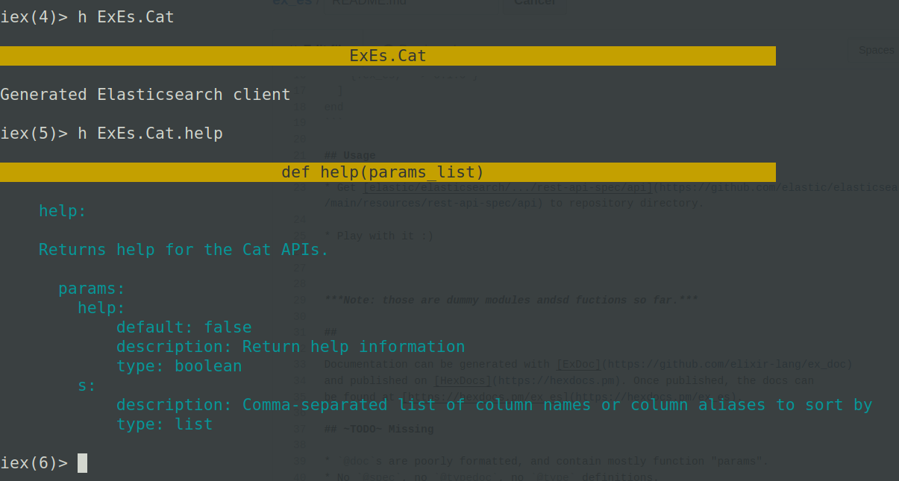

# ExEs
Elasticsearch client for Elixir

This a toy mini-project, which purpose is to play with Elixir to generate usable [Elasticsearch](https://github.com/elastic/elasticsearch) client, using [the official specification](https://github.com/elastic/elasticsearch/tree/master/rest-api-spec).

This is [pre-alpha](https://en.wikipedia.org/wiki/Software_release_life_cycle#Pre-alpha) version.

## Installation

If [available in Hex](https://hex.pm/docs/publish), the package can be installed
by adding `ex_es` to your list of dependencies in `mix.exs`:

```elixir
def deps do
  [
    {:ex_es, "~> 0.1.0"}
  ]
end
```

## Usage

* Get [elastic/elasticsearch/.../rest-api-spec/api](https://github.com/elastic/elasticsearch/tree/master/rest-api-spec/src/main/resources/rest-api-spec/api) to repository directory.

* Play with it :) 



***Note: those are dummy modules and fuctions so far.***

##

Documentation can be generated with [ExDoc](https://github.com/elixir-lang/ex_doc)
and published on [HexDocs](https://hexdocs.pm). Once published, the docs can
be found at [https://hexdocs.pm/ex_es](https://hexdocs.pm/ex_es).

## ~TODO~ Missing

* `@doc`s are poorly formatted, and contain mostly function "params".
* No `@spec`, no `@typedoc`, no `@type` definitions.
* Not idiomatic, barely working :)
* Code is a mess, function APIs are inconsistent.
* No tests.
